# 🚀 TecnoFit Deployment Workflow - Mermaid Diagram

## Complete Deployment Pipeline

```mermaid
graph TD
    Start([👨‍💻 Developer Makes Changes]) --> Trigger{Say Deploy Phrase?}
    
    Trigger -->|"Ready to deploy<br/>Push to production<br/>Commit and push"| PreDeploy[🤖 Pre-Deployment Agent Activates]
    
    PreDeploy --> Detect[🔍 Detect Changed Files]
    Detect --> CheckServer{Local Server<br/>Running?}
    
    CheckServer -->|No| StartServer[🚀 Start Local Server<br/>localhost:5173 or :5174]
    CheckServer -->|Yes| RunTests
    StartServer --> RunTests
    
    RunTests[🧪 Run Test Suite] --> TestTypes{What Changed?}
    
    TestTypes -->|Admin Files| AdminTests[🔐 Admin Panel Tests<br/>- Login admin/coach<br/>- Navigation<br/>- CRUD operations<br/>- Data integrity]
    TestTypes -->|Website Files| WebsiteTests[🌐 Website Tests<br/>- Form submission<br/>- Data to Supabase<br/>- UTM tracking<br/>- Validation]
    TestTypes -->|Database Files| DBTests[💾 Database Tests<br/>- Schema validation<br/>- RLS policies<br/>- Foreign keys]
    
    AdminTests --> CodeQuality
    WebsiteTests --> CodeQuality
    DBTests --> CodeQuality
    
    CodeQuality[🔍 Code Quality Check<br/>- No console.logs<br/>- No hardcoded credentials<br/>- Error handling<br/>- No critical TODOs] --> GenerateReport
    
    GenerateReport[📊 Generate Test Report] --> TestResults{Test Results?}
    
    TestResults -->|"100% Pass ✅"| Approve[🚦 DEPLOYMENT APPROVED]
    TestResults -->|"Any Fail ❌"| Block[🛑 DEPLOYMENT BLOCKED]
    
    Block --> ListIssues[📋 List All Failures<br/>& Suggest Fixes]
    ListIssues --> WaitFix[⏳ Wait for Developer<br/>to Fix Issues]
    WaitFix --> Retest{Fixed?}
    Retest -->|Yes| RunTests
    Retest -->|No| End1([❌ Deployment Cancelled])
    
    Approve --> GitCommit[📝 Git Commit<br/>git add -A<br/>git commit -m message]
    GitCommit --> GitPush[📤 Git Push<br/>git push origin main]
    
    GitPush --> GitHubActions[⚙️ GitHub Actions Triggered]
    
    GitHubActions --> ActionType{Which Files?}
    
    ActionType -->|Admin| AdminAction[🔨 Admin Workflow<br/>- npm ci<br/>- npm run build<br/>- Run linter<br/>- Check bundle size]
    ActionType -->|Website| WebsiteAction[🔨 Website Workflow<br/>- npm ci<br/>- npm run build<br/>- Run linter<br/>- Check bundle size]
    
    AdminAction --> ActionResult{Build Success?}
    WebsiteAction --> ActionResult
    
    ActionResult -->|"✅ Success"| VercelDetect[🔔 Vercel Detects Push]
    ActionResult -->|"❌ Failed"| ActionFail[❌ GitHub Actions Failed<br/>Check logs in Actions tab]
    ActionFail --> End2([🛑 Deployment Failed])
    
    VercelDetect --> VercelBuild{Which Project?}
    
    VercelBuild -->|Admin| VercelAdmin[🏗️ Build Admin Panel<br/>- Pull latest code<br/>- npm install<br/>- npm run build<br/>- Deploy to tecno-admin.vercel.app]
    VercelBuild -->|Website| VercelWebsite[🏗️ Build Website<br/>- Pull latest code<br/>- npm install<br/>- npm run build<br/>- Deploy to somostecnofit.com]
    
    VercelAdmin --> VercelResult{Deploy Success?}
    VercelWebsite --> VercelResult
    
    VercelResult -->|"✅ Success"| Production[🎉 LIVE IN PRODUCTION!]
    VercelResult -->|"❌ Failed"| VercelFail[❌ Vercel Build Failed<br/>Check logs in Vercel dashboard]
    VercelFail --> Rollback[🔄 Rollback to Previous Version]
    Rollback --> End3([⚠️ Rolled Back])
    
    Production --> PostDeploy{Run Post-Deploy<br/>Tests?}
    
    PostDeploy -->|Yes| SmokeTests[🔥 Smoke Tests<br/>- Login works<br/>- Pages load<br/>- Forms submit<br/>- No console errors]
    PostDeploy -->|No| End4([✅ Deployment Complete])
    
    SmokeTests --> SmokeResult{All Pass?}
    SmokeResult -->|"✅ Yes"| Monitor[📊 Monitor Production<br/>- Supabase logs<br/>- Vercel analytics<br/>- User feedback]
    SmokeResult -->|"❌ No"| Alert[🚨 Alert: Issues in Production]
    Alert --> Rollback
    
    Monitor --> End5([✅ Deployment Successful])
    
    style Start fill:#e1f5ff
    style PreDeploy fill:#fff4e6
    style Approve fill:#d4edda
    style Block fill:#f8d7da
    style Production fill:#d4edda
    style End1 fill:#f8d7da
    style End2 fill:#f8d7da
    style End3 fill:#fff3cd
    style End4 fill:#d4edda
    style End5 fill:#d4edda
```

## Simplified Flow

## Agent Activation Triggers

```mermaid
graph LR
    User[👨‍💻 Developer] -->|"Ready to deploy"| Agent[🤖 Pre-Deploy Agent]
    User -->|"Push to production"| Agent
    User -->|"Commit and push"| Agent
    User -->|"Test before deploy"| Agent
    User -->|"Ship it"| Agent
    User -->|"Going live"| Agent
    
    Agent --> Tests[🧪 Run Tests]
    
    style User fill:#e1f5ff
    style Agent fill:#fff4e6
    style Tests fill:#d4edda
```

## Test Decision Tree

```mermaid
graph TD
    Tests[🧪 Run All Tests] --> Check1{Login Works?}
    Check1 -->|✅| Check2{Navigation Works?}
    Check1 -->|❌| Fail
    
    Check2 -->|✅| Check3{CRUD Works?}
    Check2 -->|❌| Fail
    
    Check3 -->|✅| Check4{No Console Errors?}
    Check3 -->|❌| Fail
    
    Check4 -->|✅| Check5{API to Supabase?}
    Check4 -->|❌| Fail
    
    Check5 -->|✅| Check6{Code Quality OK?}
    Check5 -->|❌| Fail
    
    Check6 -->|✅| Pass[✅ APPROVED<br/>Deploy to Production]
    Check6 -->|❌| Fail[❌ BLOCKED<br/>Fix Issues First]
    
    style Pass fill:#d4edda
    style Fail fill:#f8d7da
```

## Multi-Environment Pipeline

```mermaid
graph TB
    subgraph Local["💻 Local Development"]
        Dev[Developer Machine]
        LocalServer[localhost:5173/5174]
        PreTests[🤖 Pre-Deploy Tests]
    end
    
    subgraph GitHub["📦 GitHub"]
        Repo[Git Repository]
        Actions[GitHub Actions]
    end
    
    subgraph Vercel["☁️ Vercel Cloud"]
        Build[Build Process]
        Preview[Preview Deployment]
        Prod[Production]
    end
    
    subgraph Supabase["🗄️ Supabase"]
        DB[(Database)]
        Auth[Authentication]
    end
    
    Dev --> LocalServer
    LocalServer --> PreTests
    PreTests -->|✅ Pass| Repo
    PreTests -->|❌ Fail| Dev
    
    Repo --> Actions
    Actions -->|✅ Build OK| Build
    Actions -->|❌ Build Fail| Dev
    
    Build --> Preview
    Preview -->|Test OK| Prod
    Preview -->|Issues| Dev
    
    Prod --> DB
    Prod --> Auth
    
    style PreTests fill:#fff4e6
    style Actions fill:#e1f5ff
    style Prod fill:#d4edda
    style DB fill:#cfe2ff
```

## Timeline View

## Error Handling Flow

```mermaid
graph TD
    Deploy[Attempt Deployment] --> Stage1{Pre-Deploy Tests}
    
    Stage1 -->|❌ Fail| Fix1[Fix Code Locally]
    Fix1 --> Deploy
    Stage1 -->|✅ Pass| Stage2{GitHub Actions}
    
    Stage2 -->|❌ Fail| Fix2[Fix Build Issues]
    Fix2 --> Deploy
    Stage2 -->|✅ Pass| Stage3{Vercel Build}
    
    Stage3 -->|❌ Fail| Fix3[Fix Deployment Config]
    Fix3 --> Deploy
    Stage3 -->|✅ Pass| Stage4{Smoke Tests}
    
    Stage4 -->|❌ Fail| Rollback[Rollback to Previous]
    Rollback --> Fix4[Fix Production Issues]
    Fix4 --> Deploy
    Stage4 -->|✅ Pass| Success[✅ Deployment Successful]
    
    style Fix1 fill:#fff3cd
    style Fix2 fill:#fff3cd
    style Fix3 fill:#fff3cd
    style Fix4 fill:#fff3cd
    style Rollback fill:#f8d7da
    style Success fill:#d4edda
```

## How to Use These Diagrams

1. **Copy the mermaid code** from any section above
2. **Paste into:**
   - GitHub README.md (renders automatically)
   - Mermaid Live Editor: https://mermaid.live
   - VS Code with Mermaid extension
   - Notion, Confluence, or other tools with Mermaid support

3. **Or view in Cursor:**
   - These diagrams render automatically in Markdown preview
   - Click the preview button to see them visualized

## Quick Reference

| Stage | Duration | Can Fail? | Rollback? |
|-------|----------|-----------|-----------|
| Pre-Deploy Tests | ~30s | ✅ Yes | N/A (local) |
| Git Push | ~5s | ❌ Rare | Yes (git revert) |
| GitHub Actions | ~2min | ✅ Yes | Yes (revert commit) |
| Vercel Deploy | ~2min | ✅ Yes | Yes (Vercel UI) |
| Smoke Tests | ~30s | ✅ Yes | Yes (rollback) |

**Total Time:** ~5 minutes from "ready to deploy" to production ✅

